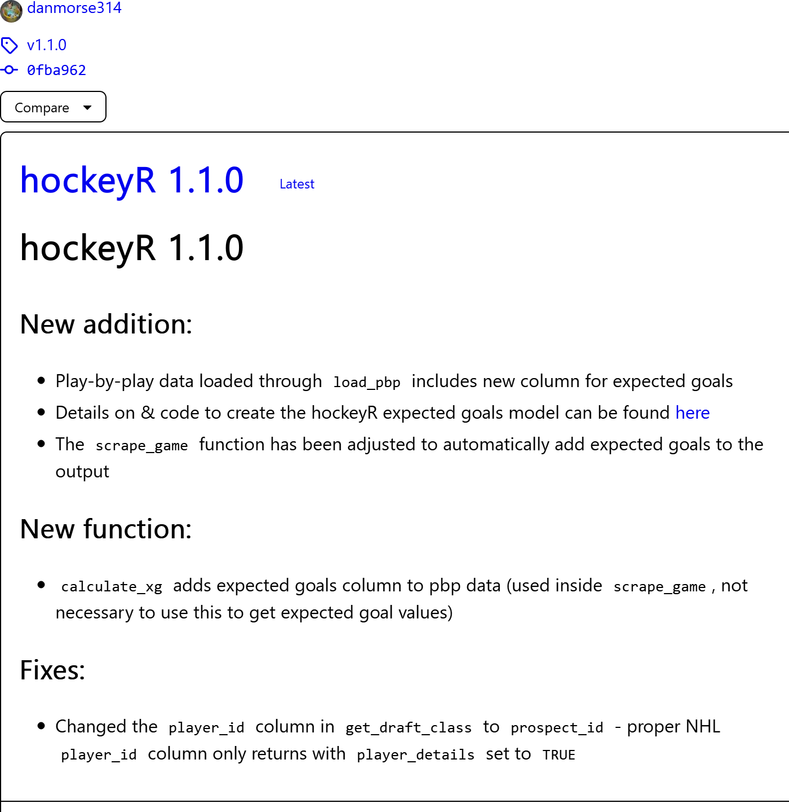

README
================
Dan Morse

## hockeyR tweets

This is the brain of
[`hockeyR`](https://github.com/danmorse314/hockeyR)’s very own [twitter
account](https://twitter.com/hockeyR_). THe bulk of this account’s
tweets are automated to post the latest commits to any of the `hockeyR`
GitHub repositories:

-   [`hockeyR`](https://github.com/danmorse314/hockeyR)
-   [`hockeyR-data`](https://github.com/danmorse314/hockeyR-data)
-   [`hockeyR-models`](https://github.com/danmorse314/hockeyR-models)

### Scraping GitHub commits

The commits are scraped using the
[`scrape commits`](https://github.com/danmorse314/hockeyR-tweets/blob/main/scrape_commits.R)
function. This hasn’t been widely tested on other repositories, so use
with caution, but in general it does the job of scraping all commits to
a given repository and returns info including author, date, commit
message, and commit ID.

``` r
source("scrape_commits.R")

hockeyr_commits <- scrape_commits(user = "danmorse314", repo = "hockeyR", branch = "master")

str(hockeyr_commits)
```

    ## tibble [35 x 9] (S3: tbl_df/tbl/data.frame)
    ##  $ owner   : chr [1:35] "danmorse314" "danmorse314" "danmorse314" "danmorse314" ...
    ##  $ repo    : chr [1:35] "hockeyR" "hockeyR" "hockeyR" "hockeyR" ...
    ##  $ author  : chr [1:35] "danmorse314" "danmorse314" "danmorse314" "danmorse314" ...
    ##  $ summary : chr [1:35] "Updated global variables in preparation for stat calculation functions" "Updated get_game_ids function to include game start time in the output" "removed \"add xg\" to future work because it's done :party-parrot:" "updated xg example" ...
    ##  $ link    : chr [1:35] "https://github.com/danmorse314/hockeyR/commit/c4b5c1b4f283645b1ff826f629eb73ee5cef570c" "https://github.com/danmorse314/hockeyR/commit/644dc83e1c076ef21349b3952b5f4f89d9bd1513" "https://github.com/danmorse314/hockeyR/commit/f3c6c9f7a0fb8f0be9d5d313e2624e18c4b6819c" "https://github.com/danmorse314/hockeyR/commit/ef00ed22f58860e4ce29118a8a29ab9f3df5477d" ...
    ##  $ commit  : chr [1:35] "c4b5c1b" "644dc83" "f3c6c9f" "ef00ed2" ...
    ##  $ datetime: POSIXct[1:35], format: "2022-09-11 10:53:45" "2022-09-11 08:12:04" ...
    ##  $ date    : chr [1:35] "2022-09-11" "2022-09-11" "2022-09-06" "2022-09-06" ...
    ##  $ time    : chr [1:35] "10:53 AM" "08:12 AM" "08:53 AM" "08:27 AM" ...

### Scraping GitHub releases

The [hockeyR\_](https://twitter.com/hockeyR_) Twitter account will also
automatically post information regarding new releases. The latest
release information is retrieved through the
[`scrape latest_release`](https://github.com/danmorse314/hockeyR-tweets/blob/main/scrape_latest_release.R)
function. Again, this hasn’t been widely tested, but it should do two
things:

1.  Take a screenshot of the release notes found in the package releases
    section. The `filename` argument of `scrape_latest_release`
    specifies where the screenshot should be saved.

2.  Return a data frame containing the title of the release, the file
    location for the screenshot taken, and a truncated version of the
    release details. The details are limited to 420 characters to
    reflect the [alt text limit on Twitter
    images](https://blog.twitter.com/developer/en_us/a/2016/alt-text-support-for-twitter-cards-and-the-rest-api#:~:text=In%20addition%20to%20Cards%2C%20we,is%20limited%20to%20420%20characters.).

``` r
source("scrape_latest_release.R")

release_info <- scrape_latest_release(
  pkg_author = "danmorse314",
  pkg_name = "hockeyR",
  filename = "example_release.png"
)
```

    ## hockeyR 1.1.0 package release notes saved as example_release.png

``` r
str(release_info)
```

    ## tibble [1 x 3] (S3: tbl_df/tbl/data.frame)
    ##  $ release   : chr "hockeyR 1.1.0"
    ##  $ details   : chr "hockeyR 1.1.0. New addition:. Play-by-play data loaded through load_pbp includes new column for expected goals."| __truncated__
    ##  $ detail_img: chr "example_release.png"

``` r
magick::image_read(release_info$detail_img)
```

<!-- -->

Follow [@hockeyR\_](https://twitter.com/hockeyR_) on Twitter to stay up
to date with the latest updates, bug fixes, and releases to the
`hockeyR` package!
